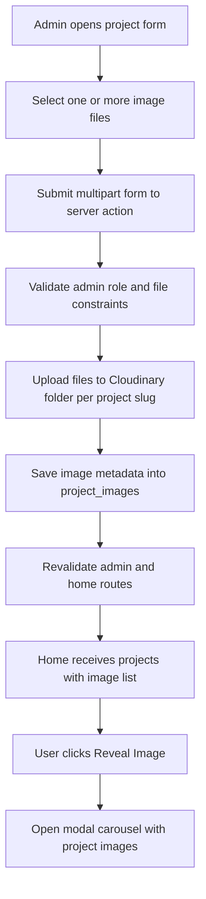

# Plan: Improve The Archivist Management + Home Image Reveal Flow

## Goals

1. Keep tech stack display in Archivist datatable as chip labels for readability and scannability
2. Add multi image support per project for Home reveal experience
3. Use secure Cloudinary API architecture with signed operations on server side only
4. Show project images on Home only after explicit user action via Reveal button then carousel modal

## Current Baseline

- The datatable already renders techs as badges in [`AdminProjectsClient`](../src/components/admin/AdminProjectsClient.jsx)
- Project create and update run through server actions in [`actions`](../src/lib/actions.js)
- Project query flattening is in [`queries`](../src/lib/queries.js)
- Home constructs UI currently has no project image reveal workflow in [`ConstructsSection`](../src/components/ConstructsSection.js)

## Target Data Model

Use a dedicated image table instead of embedding arrays into projects.

### New table

`project_images`

- `id` uuid primary key
- `project_id` uuid not null references `projects(id)` on delete cascade
- `cloudinary_public_id` text not null unique
- `image_url` text not null
- `secure_url` text not null
- `width` integer
- `height` integer
- `format` text
- `bytes` integer
- `alt_text` text null
- `sort_order` integer default 0
- `is_primary` boolean default false
- `created_at` timestamptz default now

### Indexing and constraints

- index on `project_id`
- index on `project_id, sort_order`
- optional partial unique index for one primary image per project where `is_primary = true`

## Cloudinary Integration Architecture

### Environment variables

- `CLOUDINARY_CLOUD_NAME`
- `CLOUDINARY_API_KEY`
- `CLOUDINARY_API_SECRET`
- `CLOUDINARY_UPLOAD_FOLDER` default `grimoire/projects`

### Security principles

1. Never expose API secret to client
2. Admin authorization check before every upload and delete
3. Validate mime type and file size server side
4. Use deterministic folder naming by project slug
5. Persist both `public_id` and `secure_url`

### Recommended operation style

- Use server side upload via Node SDK in server action
- For direct client upload in future, provide a signed signature endpoint
- Use `cloudinary.uploader.destroy` when image removed from project

## Backend Changes

### Server actions

Extend [`createProject`](../src/lib/actions.js) and [`updateProject`](../src/lib/actions.js) with image pipeline.

- Parse `images` files from form data
- Upload each file to Cloudinary
- Insert rows into `project_images`
- On update
  - support add new images
  - support remove selected images with Cloudinary delete and DB delete
  - support reorder and primary flag update

Add dedicated actions:

- `addProjectImages projectId formData`
- `removeProjectImage imageId`
- `reorderProjectImages projectId orderPayload`

### Queries

Extend [`fetchProjects`](../src/lib/queries.js) to include nested `project_images` sorted by `sort_order, created_at`.

Return shape proposal:

- `project.images` array with lightweight fields
  - `id`
  - `secure_url`
  - `alt_text`
  - `sort_order`
  - `is_primary`
  - `width`
  - `height`

## Archivist UI Plan

### Datatable improvements

In [`AdminProjectsClient`](../src/components/admin/AdminProjectsClient.jsx)

1. Keep current tech stack chips, standardize as compact label chips
2. Add new column `Images`
3. Show summary chip like `3 images`
4. Optional quick status chip `Primary set` or `No primary`

### Project form improvements

In [`ProjectForm`](../src/components/admin/ProjectForm.jsx)

1. Add file input with `multiple` for image uploads
2. Add existing image list preview when editing
3. Per image controls
   - set primary
   - remove
   - reorder
   - optional alt text

## Home UX Plan

In [`ConstructsSection`](../src/components/ConstructsSection.js)

1. Add `Reveal Images` button near `View Source`
2. Button only active when `activeProject.images.length > 0`
3. Clicking button opens modal with carousel
4. Carousel controls
   - previous and next
   - thumbnail dots or mini chips
   - close button
5. Lazy load image only when modal opens

## Implementation Sequence for Code Mode

1. Add SQL migration for `project_images` and indexes
2. Add Cloudinary helper module for upload and destroy
3. Extend server actions for create update image lifecycle
4. Extend query layer with `project_images`
5. Update admin datatable and form UI
6. Update home constructs reveal modal carousel
7. Run Playwright verification for home reveal flow and basic admin UI checks
8. Add regression checks for project CRUD without images

## Acceptance Criteria

1. Archivist table shows readable tech chips and image count column
2. Admin can upload multiple project images in create and edit flows
3. Image deletion removes both DB row and Cloudinary asset
4. Home only displays project images after user presses reveal button
5. Reveal modal supports carousel navigation for multiple images
6. No Cloudinary secret exposed to browser
